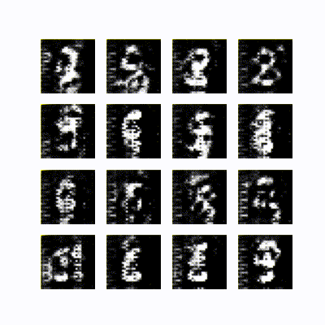

# Wasserstein GAN implementaiton

Implementation of Wasserstein GAN from article [Wasserstein GAN](https://arxiv.org/abs/1701.07875).
In this implementation requred 1-Lipshitz constraint is smoothly enforced using [improved training idea](https://arxiv.org/pdf/1704.00028.pdf).

Note: see those [notes](https://arxiv.org/pdf/1801.04406.pdf) on convergence of Wasserstein GAN.

<table style="margin: auto; width: 100%">
    <tr style="border: none">
        <td style="border: none"></td>
        <td style="border: none"></td>
    </tr>
    <tr style="border: none">
        <td style="text-align: center ; border: none"><b>GAN</b></td>
        <td style="text-align: center ; border: none"><b>WGAN</b></td>
    </tr>
</table>

#### Requirements
* tensorflow~=2.6.0
* numpy~=1.19.5
